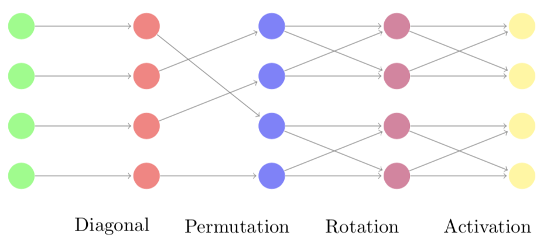

# Volume Preserving Neural Networks
## Implementation in PyTorch




A neural network architecture that is fully volume preserving including the coupled chebyshev volume preserving activation function.

This is the implementation of the paper:

G. MacDonald, A. Godbout, B. Gillcash, and S. Cairns. Volume Preserving Neural Networks: A Solution to the Vanishing Gradient Problem. (2019)

link to paper (arXix preprint): https://arxiv.org/abs/1911.09576

If you use this code, please cite (arXiv preprint):

```
@misc{macdonald2019volumepreserving,
    title={Volume-preserving Neural Networks: A Solution to the Vanishing Gradient Problem},
    author={Gordon MacDonald and Andrew Godbout and Bryn Gillcash and Stephanie Cairns},
    year={2019},
    eprint={1911.09576},
    archivePrefix={arXiv},
    primaryClass={cs.LG}
}
```


## Getting Started ###

    -demo_mnist jupyter notebook provides a demonstration of the VPNN on the MNIST dataset

## Dependencies ###
    - Torch 1.1.0
    - torchvision 0.3.0
    - matplotlib 3.1.1
    - numpy 
    - nltk 
    - jupyter
    - sklearn
    - seaborn


